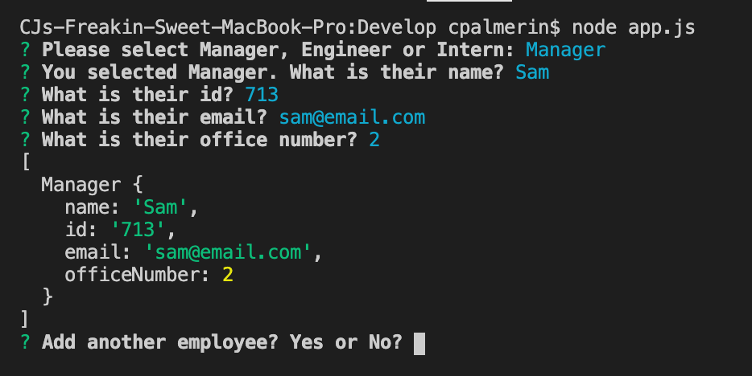
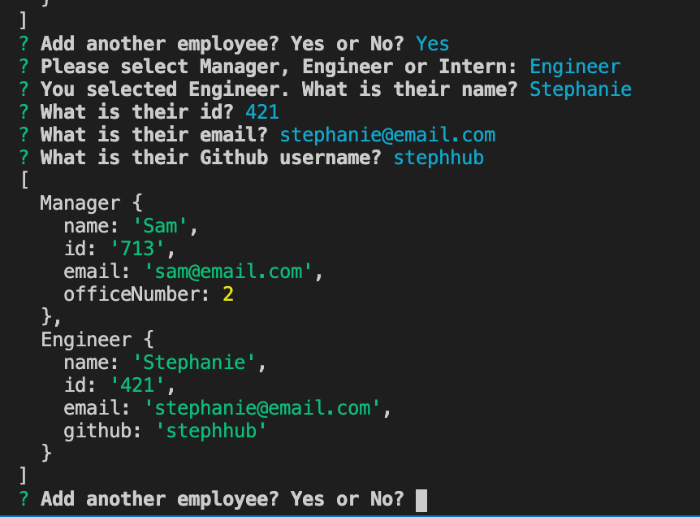
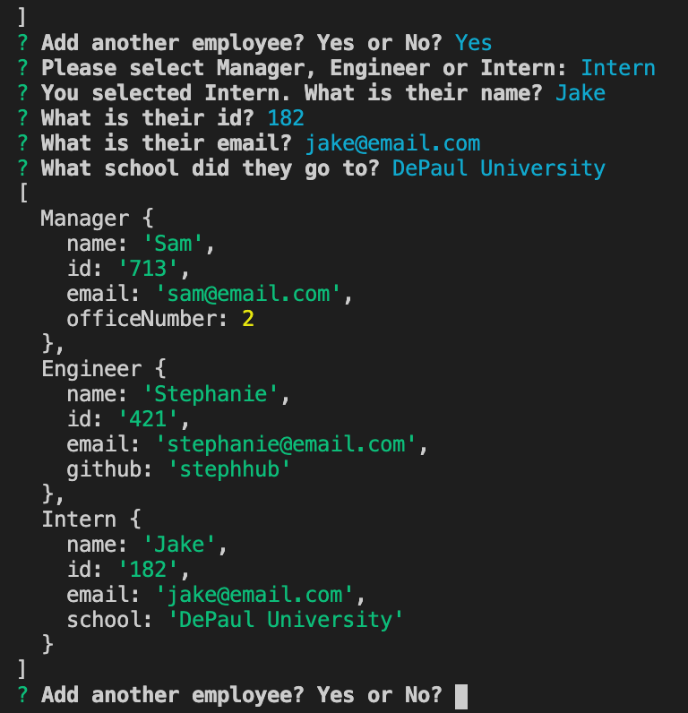
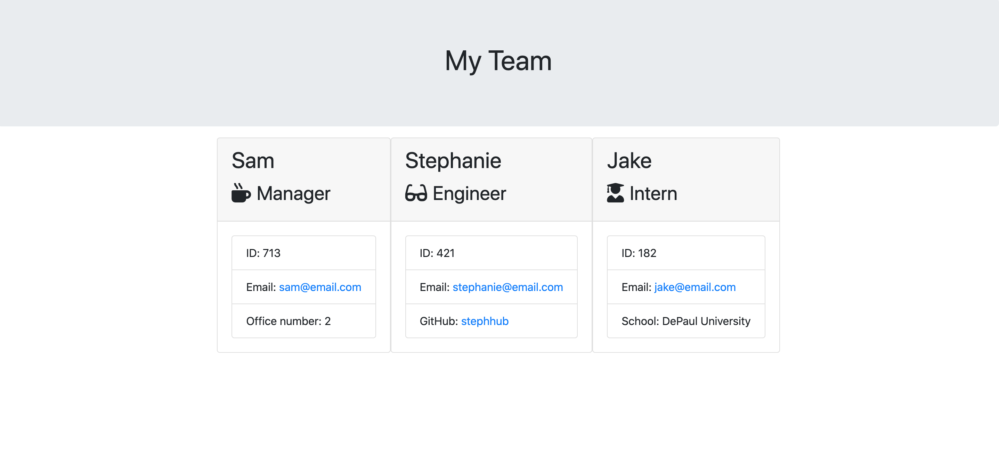

# Employee Template Engine

## Description

The Employee Template Engine allows the user to input employee info via CLI and creates summaries of their employees based on that input. Users can see their employee info in their browser via the team.html document that is generated and placed into the output folder.

### Table of Contents

[Installation](#installation)
[Usage](#usage)
[License](#license)
[Contributing](#contributing)
[Tests](#tests)
[Questions](#questions)

### Installation

The user is required to have inquirer installed in order to run the app.js. You can see the dependency to run in the package.jsoon file and run an npm install from there.

## Usage

First, please make sure that inquirer is installed. From there app.js while prompt you with whether or not you want to log info for a manager, engineer, or an intern. You will then be prompted with more questions depending on which employee type you want to log in. For all three types of employees, you will be asked for their name, id, and email. For managers you will be asked for their office number, for engineers you will be asked for their github username, and for interns you will be asked for the school they attend/attended. After each employee you add you will be asked if you would like to add another.

When you are done adding employees, a team.html will then be generated in the output folder where you can then see your employee engine.

### License

### Contributing

cjpalmerin

### Tests

In order to run tests, please install jest. Test files for all classes and subclasses can be found inside of the test folder. All tests pass with current logic.

### Questions
### cjpalmerin@gmail.com

